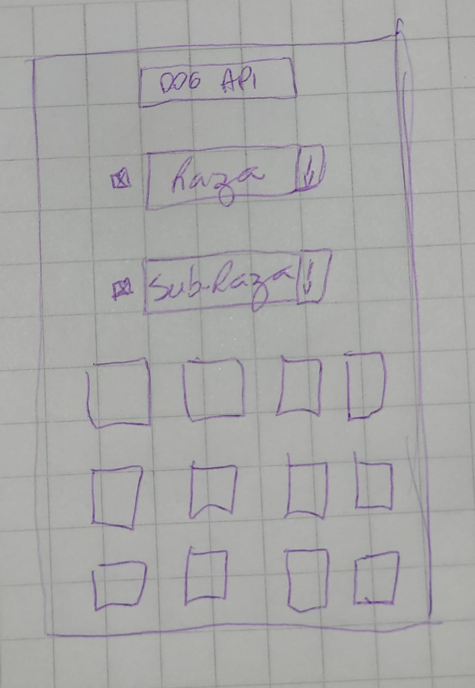

# Proyecto Dog Breeds

**[Link Dog Breeds Show](https://dogbreeds-show.web.app/)**

#

### Proyecto para desafio Mobdev.

###### diseños hecho a mano:

#

#

**Herramientas utilizadas:**

- React Hooks,
- Bootstrap,
- Hosting - Firebase
- CSS,
- librería para iconos,
- Figma

#

## Autor@:

[Fabiane Santos GitHub1](https://github.com/FabianeSantos?tab=repositories)

[Fabiane Santos GitHub2](https://github.com/FabiSantos?tab=repositories)

